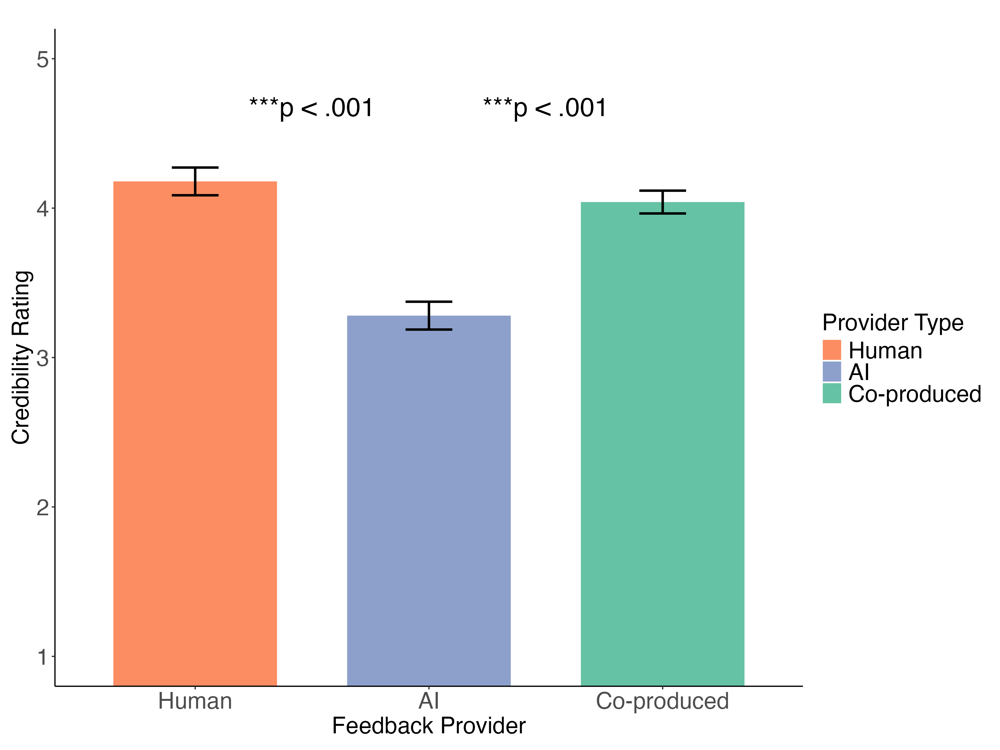
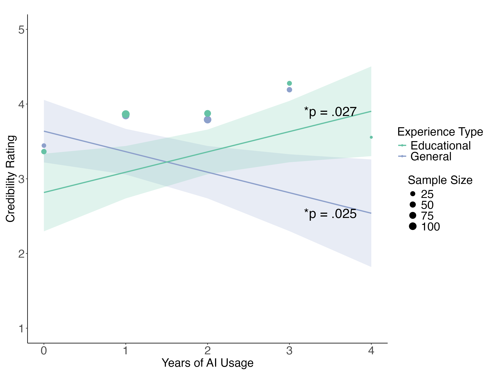
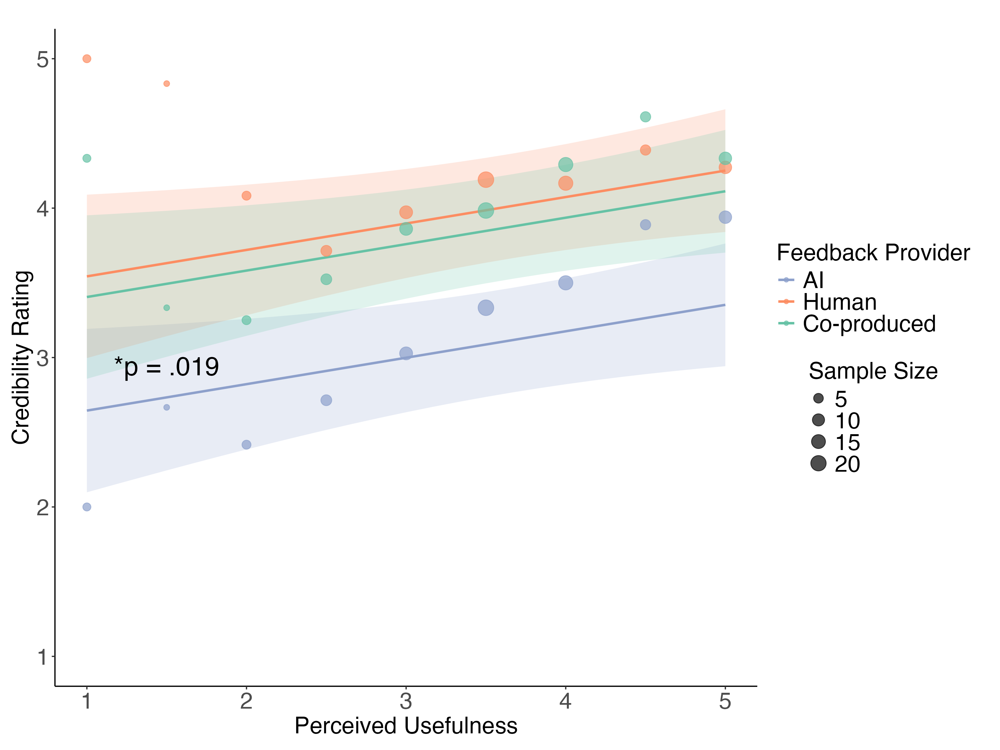

AI vs. Human Feedback: Student Trust and Learning Outcomes
An experimental study investigating how students perceive and respond to AI-generated, human, and co-produced (human + AI) feedback in higher education statistics courses. This repository contains the complete research pipeline from feedback generation to statistical analysis.
Research Overview
This study examines whether the source of feedback (AI, human instructor, or co-produced) affects:

Student perceptions of feedback credibility, usefulness, and genuineness
Learning outcomes on transfer tasks
Trust in different feedback providers

The research was conducted with undergraduate students in two statistics courses (PALS0045 and PALS0046) at University College London, generating AI feedback using Claude API and comparing student responses across conditions.
Repository Structure
🔧 Feedback Generation Tools

feedback_generator.py - Automated feedback generation system using Anthropic's Claude API

Generates AI feedback based on student submissions and model answers
Creates hybrid (co-produced) feedback by enhancing human instructor feedback with AI
Processes submissions for both courses with error handling and progress tracking

📊 Statistical Analysis Scripts

ECTel_adapted.R - Main analysis pipeline including:

Reliability analysis (Cronbach's alpha for scales)
Mixed-effects models examining feedback provider effects
Demographic analyses (gender, age, AI experience)
Transfer task performance comparisons
Comprehensive data visualization

Analysis of Demographics and Feedback Provider Identification.Rmd - Demographic analysis and feedback source identification accuracy
Analysis of Feedback Provider Identity Impact on Student Perceptions.Rmd - Examination of how knowledge of feedback source affects student perceptions

📈 Key Visualizations
Credibility Analysis

6a_Mean credibility ratings by feedback provider type.png - Main effect of feedback provider on credibility
6b_relationship between years of AI usage and credibility.png - AI experience moderating effects
6c_Influence of perceived usefulness on credibility ratings.png - Usefulness-credibility relationship

Usefulness Analysis

combined_usefulness_plots.png - Gender and AI experience effects on perceived usefulness
AI_years_usefulness_effect.png - AI experience impact on usefulness ratings

Combined Analysis

combined_credibility_analysis.png - Multi-panel credibility findings

Sample Outputs
Credibility Ratings by Feedback Provider

AI Experience Effects on Credibility

Perceived Usefulness and Credibility

Research Workflow
1. Feedback Generation (Python)
   ├── Collect student submissions and human instructor feedback
   ├── Generate AI feedback using Claude API
   └── Create hybrid feedback combining human + AI
   
2. Experimental Deployment
   ├── Present feedback to students (blind to source)
   ├── Collect perception ratings (credibility, usefulness, genuineness)
   └── Administer transfer tasks
   
3. Data Analysis (R)
   ├── Reliability analysis of scales
   ├── Mixed-effects models
   ├── Demographic analyses
   └── Transfer task performance
   
4. Visualization & Reporting
   └── Generate publication-ready figures
Key Research Questions
RQ1: Do students perform differently on transfer tasks based on feedback provider?

Examines learning outcomes across AI, human, and co-produced feedback

RQ2: How do students perceive feedback quality across different providers?

Analyzes ratings of usefulness, objectivity, and genuineness

RQ3: What factors predict perceived credibility of feedback?

Investigates effects of feedback provider, AI experience, and perceived usefulness

Methods
Experimental Design

Participants: Undergraduate students in two statistics courses (N = 200+)
Conditions: AI-generated, human instructor, and co-produced feedback
Measures:

Perceived credibility, usefulness, objectivity, genuineness (Likert scales)
Transfer task performance (binary: correct/incorrect)
AI experience (general and educational context)
Demographics (age, gender, course)

Feedback Generation
The Python script uses Claude 3.5 Sonnet to:

Generate formative feedback based on student submissions and model answers
Enhance human instructor feedback to create co-produced versions
Maintain consistent formatting (≤3 lines, student-facing language)

Statistical Analysis

Mixed-effects models accounting for repeated measures (students rated multiple feedback types)
Reliability analysis using Cronbach's alpha for multi-item scales
Chi-square tests for categorical outcomes (transfer task performance)
Post-hoc comparisons with Bonferroni corrections

Required Dependencies
Python
bashpip install anthropic pandas python-dotenv tqdm
R
r# Statistical analysis
install.packages(c("lme4", "lmerTest", "emmeans", "psych", "car"))

# Data manipulation
install.packages(c("dplyr", "tidyr", "tidyverse", "purrr", "stringr", "forcats"))

# Visualization
install.packages(c("ggplot2", "gridExtra", "ggsignif", "ggpubr", "RColorBrewer"))

# Additional utilities
install.packages(c("report", "MASS", "lmtest"))
Usage
Generating Feedback
python# Set up environment variables
# Create .env file with: ANTHROPIC_API_KEY=your_api_key_here

# Run feedback generation
python feedback_generator.py
Running Analysis
r# Open R or RStudio
# Set working directory to repository location
setwd("path/to/repository")

# Source the main analysis script
source("ECTel_adapted.R")

# Or open and knit the R Markdown files
# File > Open > Analysis of Demographics and Feedback Provider Identification.Rmd
Key Findings
Note: Detailed findings are documented in the analysis scripts and visualizations
Credibility Perceptions:

Significant differences in credibility ratings across feedback providers (p < .001)
AI experience moderates credibility judgments
Perceived usefulness predicts credibility ratings (p = .019)

Individual Differences:

Gender differences in perceived usefulness for human feedback
Years of AI usage relates to feedback credibility perceptions
Both general and educational AI experience show distinct effects

Data Privacy & Ethics
In accordance with research ethics protocols:

Individual student data is not included in this repository
All visualizations present aggregate or de-identified results
The code demonstrates methodology and can be adapted for similar research

Research was conducted with appropriate ethical approval and informed consent.
Research Context
This work contributes to understanding how AI tools can support formative assessment in higher education. Key contributions include:

Methodological innovation: Systematic comparison of AI, human, and co-produced feedback
Practical implications: Insights for implementing AI feedback systems in education
Theoretical advancement: Understanding trust and credibility in AI-assisted learning
Open science: Transparent, reproducible analysis pipeline

Citation
If you use or adapt this methodology for your research, please cite:
Zhongyao, A. (2025). AI vs. Human Feedback: Student Trust and Learning Outcomes 
R. GitHub. https://github.com/AudreyZhongyao/ai-trust-student-feedback
Related Publications
To be updated with publication information
Contact
Audrey Zhongyao
zhongyao.zhang.19@ucl.ac.uk
PhD Candidate, Experimental Psychology, University College London
Education Policy Intern, UNESCO Paris
Research focus: AI in education, learning analytics, formative assessment

For questions about methodology, collaboration opportunities, or access to de-identified data for meta-analyses, please reach out via GitHub.
Acknowledgments
This research was conducted as part of doctoral studies at UCL's Department of Experimental Psychology. The study utilized Claude API (Anthropic) for automated feedback generation.
License
This project is available for academic and educational purposes. Please contact for commercial use inquiries.

Keywords: artificial intelligence in education, formative feedback, student trust, learning analytics, AI-assisted assessment, educational technology, mixed-methods research, higher education, statistics education, human-AI collaboration
Technologies: Python, R, Claude API (Anthropic), mixed-effects modeling, experimental design, data visualization # ai-trust-student-feedback
Experimental study examining student trust in AI vs. human feedback in higher education. Mixed-methods analysis of credibility perceptions and learning outcomes.
